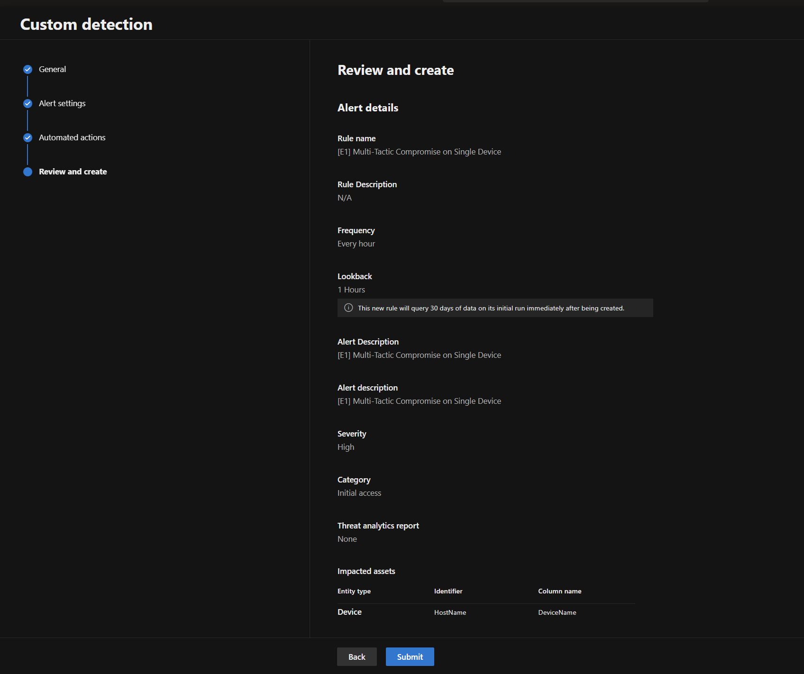

# Exercise 6 — Cost Management & Ingestion Analysis

**Topic:** Monitor Sentinel costs using Usage tables and the ingestion dashboard
**Difficulty:** Intermediate

---

### Objective

Understand how Microsoft Sentinel billing works, query the **Usage** and **LAIngestionStatus** tables to analyse ingestion volume per table, and learn strategies to control costs.

### Background

Microsoft Sentinel costs are primarily driven by **data ingestion volume** (GB/day). Understanding which tables contribute the most to ingestion is critical for cost optimisation.

Key billing concepts:

| Concept | Description |
|---|---|
| **Analytics logs** | Full-featured tier with 90-day interactive retention. Pay per GB ingested. |
| **Basic logs** | Lower cost, limited to 8-day interactive queries. Good for high-volume, low-value data. |
| **Auxiliary logs** | Lowest cost tier for compliance/audit data. 30-day interactive retention. |
| **Free data sources** | Some tables (e.g., `AzureActivity`, `SecurityAlert`) are free to ingest. |
| **Commitment tiers** | Pre-purchase a daily GB commitment at a discount (100, 200, 400 GB/day tiers). |

> **Reference:** [Plan costs and understand Microsoft Sentinel pricing](https://learn.microsoft.com/en-us/azure/sentinel/billing)

---

### Steps

#### Step 1 — Query Ingestion Volume by Table

Open **Advanced Hunting** in the Microsoft Defender portal and run:

```kusto
Usage
| where TimeGenerated > ago(30d)
| where IsBillable == true
| summarize
    TotalGB = round(sum(Quantity) / 1024, 2)
    by DataType
| sort by TotalGB desc
```

This shows every table's billable ingestion over the last 30 days, in GB.

Now break it down by day to spot ingestion trends:

```kusto
Usage
| where TimeGenerated > ago(30d)
| where IsBillable == true
| summarize
    DailyGB = round(sum(Quantity) / 1024, 2)
    by bin(TimeGenerated, 1d), DataType
| sort by TimeGenerated desc, DailyGB desc
```

> **Key insight:** Look for tables with unusually high ingestion on specific days. This often indicates a misconfigured data connector or a spike in activity (e.g., a noisy scanning rule).

#### Step 2 — Identify the Top Cost Drivers

Find your top 5 most expensive tables:

```kusto
Usage
| where TimeGenerated > ago(30d)
| where IsBillable == true
| summarize
    TotalGB = round(sum(Quantity) / 1024, 2),
    DailyAvgGB = round(sum(Quantity) / 1024 / 30, 3)
    by DataType
| top 5 by TotalGB
| extend EstMonthlyCostUSD = round(TotalGB * 4.30, 2) // Approximate pay-as-you-go rate
```

> **Note:** The cost estimate uses an approximate pay-as-you-go rate of $4.30/GB. Your actual rate depends on your pricing tier and region. Check the [Azure pricing calculator](https://azure.microsoft.com/pricing/details/microsoft-sentinel/) for current rates.

In a lab environment, your ingestion is likely small. In production, `CommonSecurityLog` (firewall) and `SecurityEvent` (Windows) are typically the largest tables.

#### Step 3 — Analyse Ingestion Latency

The `_IngestedDate` column (available on most tables via `ingestion_time()`) tells you when data arrived in the workspace — useful for identifying ingestion delays:

```kusto
CommonSecurityLog
| where TimeGenerated > ago(7d)
| extend IngestionDelay = ingestion_time() - TimeGenerated
| summarize
    AvgDelayMinutes = round(avg(IngestionDelay / 1m), 1),
    MaxDelayMinutes = round(max(IngestionDelay / 1m), 1),
    P95DelayMinutes = round(percentile(IngestionDelay / 1m, 95), 1)
    by bin(TimeGenerated, 1d)
| sort by TimeGenerated desc
```

High ingestion latency can delay alert firing. If you see delays above 15 minutes, investigate the data connector or source system.

#### Step 4 — Monitor Ingestion with the Usage Dashboard

##### Option A — Cost Management page (Defender portal)

The Defender portal includes a dedicated **Cost management** page with built-in usage reports:

1. In the Microsoft Defender portal, navigate to **Settings** → **Microsoft Sentinel** → **Cost management**
2. Review the **Usage reports** section — it shows **Data lake ingestion volume** and **Compute hours consumed** over the current month
3. Click **Data lake ingestion** to open the full **Usage reports** dashboard



The **Usage reports → Ingestion** tab provides:

- **Total GBs ingested** with trend comparison to the previous month
- **Top 10 tables by volume** — a line chart showing ingestion trends per source table over time
- A detailed table listing each table name and its total GB ingested
- Filters by **table name**, **region**, and **time range**


> **Tip:** Use the **Lake storage** and **Advanced analytics** tabs to review data lake storage costs and compute usage separately.

> **Reference:** [Monitor costs — Usage page](https://learn.microsoft.com/en-us/azure/sentinel/billing-monitor-costs#usage)

##### Option B — Workspace Usage Report workbook

Microsoft Sentinel also provides a classic workbook-based dashboard:

1. Navigate to **Microsoft Sentinel** → **Threat management** → **Workbooks**
2. Search for **Workspace Usage Report** in the templates
3. Click **View saved workbook** (or **Save** it first if not yet saved)

The workbook shows:

- **Daily ingestion volume** by table
- **Ingestion trends** over time
- **Billable vs free** data breakdown
- **Agent health** and data connector status

> **Tip:** If the workbook is not available, you can install it from **Content Hub** → search for "Workspace Usage Report".

#### Step 5 — Cost Optimisation Strategies

Based on your analysis, consider these optimisation strategies:

| Strategy | Action | Savings |
|---|---|---|
| **Filter at ingestion** | Use Data Collection Rules (DCR) to drop unnecessary columns or rows before ingestion | Reduces volume directly |
| **Use commitment tiers** | If you ingest 100+ GB/day consistently, switch from pay-as-you-go to a commitment tier | Up to 50% discount |
| **Archive to long-term storage** | Data beyond interactive retention moves to archive tier at ~$0.02/GB/month | 90%+ savings on old data |

> **Tip:** For hands-on practice with table tiers (Analytics, Basic, Data Lake) and retention settings, see Exercise 7 (Table Management).

#### Step 6 — Set Up an Ingestion Alert (Optional)

Create an alert rule that fires when daily ingestion exceeds a threshold:

```kusto
Usage
| where TimeGenerated > ago(1d)
| where IsBillable == true
| summarize DailyGB = round(sum(Quantity) / 1024, 2)
| where DailyGB > 5 // Adjust threshold to your environment
```

To create this as a Sentinel analytics rule:

1. Run the query in Advanced Hunting
2. Click **Create detection rule**
3. Set the schedule to run **every 24 hours** with a **1-day lookback**
4. Name it `[Cost] Daily ingestion exceeds threshold`
5. Set severity to **Informational**

> **Tip:** In production, set the threshold to 10-20% above your normal daily average. This catches unexpected ingestion spikes before they impact your bill.

---

### Key Takeaways

- The **`Usage`** table is your primary source for understanding ingestion costs — always filter on `IsBillable == true`
- **Top cost drivers** in most environments are firewall logs (`CommonSecurityLog`), Windows events (`SecurityEvent`), and identity logs
- **`ingestion_time()`** helps diagnose ingestion delays that can affect alert freshness
- The **Workspace Usage Report** workbook provides a visual overview of ingestion trends
- **Commitment tiers** provide significant discounts for consistent daily ingestion above 100 GB
- Set up **ingestion alerts** to catch unexpected cost spikes early

### Microsoft Learn References

- [Plan costs and understand Microsoft Sentinel pricing](https://learn.microsoft.com/en-us/azure/sentinel/billing)
- [Monitor costs for Microsoft Sentinel](https://learn.microsoft.com/en-us/azure/sentinel/billing-monitor-costs)
- [Reduce costs for Microsoft Sentinel](https://learn.microsoft.com/en-us/azure/sentinel/billing-reduce-costs)
- [Usage table schema reference](https://learn.microsoft.com/en-us/azure/azure-monitor/reference/tables/usage)
